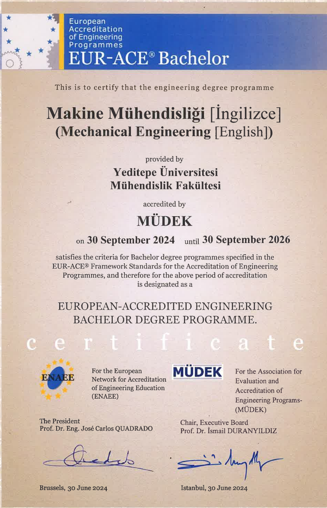
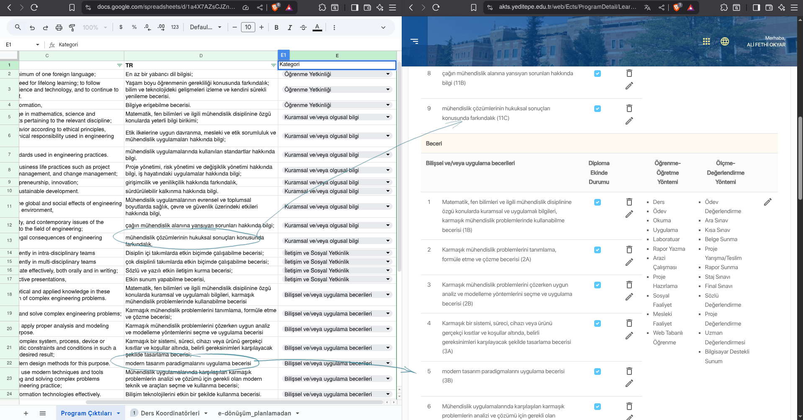
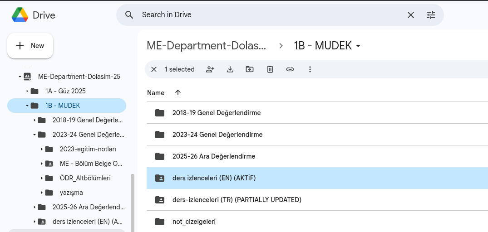
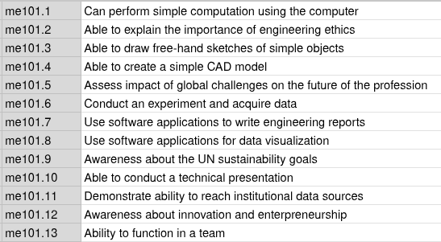
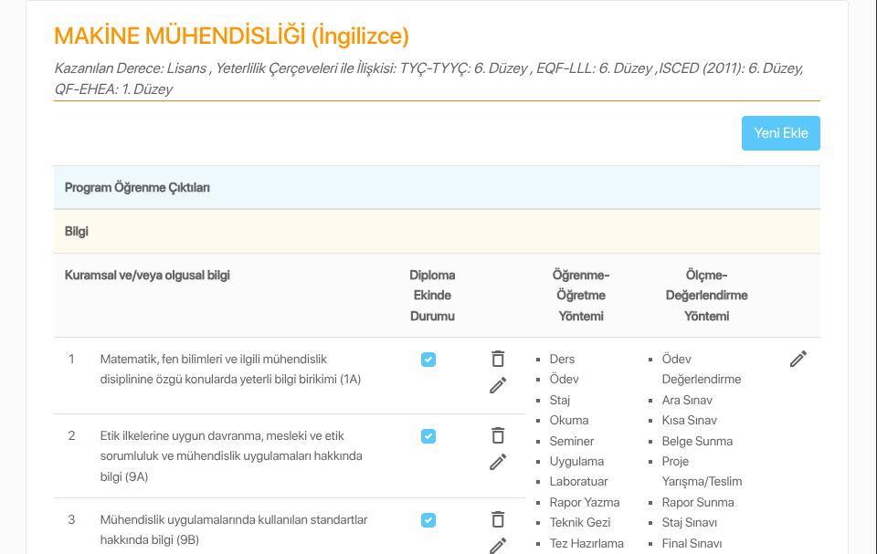

#+TITLE:  AKTS Bilgi Paketi ve Ders Kataloğu Sistemi
#+AUTHOR: Fethi Okyar
#+DATE: 2025-09-30
#+SUBTITLE: Makine Mühendisliği Özelinde Pilot Çalışma
#+DESCRIPTION: AcadeMEET Leaders Toplantısı, Doğa Kulüp, Şile
#+STARTUP: overview
#+REVEAL_THEME: simple
#+REVEAL_INIT_OPTIONS: slideNumber:"c/t", width:1920, height:1080
#+REVEAL_TITLE_SLIDE: <h2>%t</h2> <h3>%s</h3> <h4>%d</h4>
#+OPTIONS: timestamp:nil toc:1 num:t
#+REVEAL_EXTRA_CSS: ../style.css
#+REVEAL_ROOT: https://cdn.jsdelivr.net/npm/reveal.js
#+HTML_HEAD_EXTRA: 

* Lisans Programı Kalite Unsurları
#+ATTR_REVEAL: :frag (appear)
- “Avrupa Yükseköğretim Alanı Standartları” ile uyumlu eğitim yaklaşımımızı güçlendirme, şeffaflık ve öğrenci hareketliliğimizi daha da artırma hedefimiz doğrultusunda, Avrupa Kredi Transfer ve Biriktirme Sistemi (AKTS) çerçevesindeki çalışmalarımızı başarıyla yürütmekteyiz.
- Bu kapsamda, yeni AKTS Bilgi Paketi ve Ders Kataloğu sistemini hayata geçirmemizin heyecanını yaşıyoruz.
- [[https://akts.yeditepe.edu.tr]]
  
** Lisans Programı Akreditasyonu
Makine Mühendisliği lisans programı MÜDEK akreditasyon çerçevesinde kalite güvencesi altına alınmıştır.
#+ATTR_HTML: :width 900px

** Genel Tanımlar
#+ATTR_REVEAL: :frag (appear)
- Değerlendirme Ölçütleri
- Eğitim Amaçları
- Program Çıktıları (/Student Outcomes/)
- Ders İzlencesi (Dersin Bologna Formu)
- Ders Öğrenim Çıktıları
  
* Program Çıktıları (PÇler)
#+ATTR_REVEAL: :frag (appear)
- Bir lisans programında bulunan zorunlu derslerin PÇ'ler ile ilişkilerini gösterir [[https://docs.google.com/spreadsheets/d/1bJQ0qudEjDyVrWRoc4igUmyrSeVf5Ob9HRCqLXtHUII][Tablo-1]] (MMB mudekMatrisi).
- Tablo şart değildir ancak süreç yönetimi ve sürdürebilirlik açılarından faydalı uygulamadır.
  
** PÇ Veri Girişi
Programların bilgi girişi için hazırlanan [[https://docs.google.com/spreadsheets/d/1a4X7AZsCJZnFOG4xGZnttD-VpZdev9at96xYA5wilXQ][Tablo-2]] (ME AKTS İZLENCE GİRİŞLERİ) ile AKTS portalına giriş ekranı arasındaki veri akışı.

#+REVEAL:split
#+ATTR_HTML: :width 1800px

** Simülasyon 1: PÇ Girişi
#+ATTR_REVEAL: :frag (appear)
- PÇ'ler AKTS portaldaki kategorilere göre ayırılmıştır.
- Girişi yapacak olan iki yetkili bulunmaktadır.
  - Bölüm Kalite Güvence Yetkilisi (Bölüm Başkanı)
  - Bölüm Kalite Koordinatörü
- Bu kişilerin haricinde *geçici* veri girişi yapacak personel mailto:ybehlevan.yeditepe.edu.tr ye bildirilir.   
- Öğrenci Bilgi Sistemi'nde (OBS) bulunan veriler ile uyumluluk kontrolü yapılır.

** Eğitim Amaçları Veri Girişi
#+ATTR_REVEAL: :frag (appear)
- Lisans programına ait eğitim amaçları girilir.
- Ayrıca [[https://akts.yeditepe.edu.tr/web/Ects/ProgramDetail/OutcomeAimObjectiveMatrix?PID=207&BID=182][Eğitim Amaçları/PÇ İlişkilendirme Matrisi]] doldurulur.
  #+ATTR_REVEAL: :frag (appear)
  - Her bir PÇ için eğitim amaçlarına hizmet/katkı/ilişkisini gösteren bir işaretleme yapılır.
  - İşaretlemenin var/yok şeklinde yapılması için 0 ya da 1 seçeneği işaretlenir.
  - var/yok ya da 0/1 yöntemi atama ve kontrolde kolaylık sağlar.

* Ders İzlenceleri
** Bologna Ders Formları (BDF)
#+ATTR_REVEAL: :frag (appear)
- Öğretim üyelerinin dersin başında kullanıdıkları izlence ile birebir aynı olmasa da, ders ile ilgili tüm teknik detayları bulunduran formdur. Bu çerçevede ders izlencesi ile eş anlamlı olarak kullanılmıştır.
- Örnek bir ders izlencesi: [[https://docs.google.com/document/d/1BQ1joOHml0iuGShx8oJ5F09zGMnYfJKDcDqef7Bw0iQ][ME 101 Introduction to Mechanical Engineering]]

** İzlencelerin Takibi
#+ATTR_HTML: :width 900px

#+ATTR_REVEAL: :frag (appear)
- İzlencelerin AKTS portalına girilmesi öncesinde en son sürümlerinin toplanması gereklidir.
- Bölümde izlencelerin tek ve en son sürümlerinin tutulduğu ve erişilebildiği bir /Google Paylaşım/ klasörü oluşturmak *faydalı uygulama* olarak görülebilir.
- İzlencede zaman içerisinde meydana gelen değişikliklerin takibinde /Google sürüm yöneticisi/ kullanımı bir başka *faydalı uygulama* olarak görülebilir.

** Ders Planı
#+ATTR_REVEAL: :frag (appear)
- Lisans programlarının ders programları portala aktarılırken OBS (ya da bilinen eski adıyla e-dönüşüm) sisteminde veri akışı sağlanmıştır.
- Örnek bir ders planı: [[https://akts.yeditepe.edu.tr/web/Ects/ProgramDetail/CourseStructure?PID=207&BID=182][Makine Mühendisliği Lisans Programı]]

** İzlence Veri Girişi
Programda yer alan ders izlencelerinin veri girişi Bölüm yetkilileri tarafından yapılır.

#+REVEAL:split
#+ATTR_HTML: :width 1800px
[[./RESIM_2.png
]]
*** Ders Öğrenim Çıktıları (DÖÇ)
#+ATTR_HTML: :width 900px

#+ATTR_REVEAL: :frag (appear)
- Her bir dersin kendine ait öğrenim çıktıları, kısa ve öz, mümkünse PÇ'ler ile birebir ilişki içerisinde tanımlanır.
- Öğrenim çıktılarının yazımı ile ilgili gerekli ve yeterli teknik bilgi için: YULEARNT-Eğiticilerin Eğitimi ([[https://yulearn.yeditepe.edu.tr/course/view.php?id=15881][TEACH101.2]])
  
*** DÖÇ/PÇ İlişkilendirme Matrisi
- Dersin öğrenim çıktıları ile program çıktıları arasındaki bağlantılar ilgili matriste işaretlenir.
- İşaretlemenin var/yok şeklinde olması için 0 ya da 1 seçeneği işaretlenir.
- var/yok yani 0/1 yöntemi atama ve kontrolde kolaylık sağlar.
  

#+REVEAL: split
Soru/Cevap

#+REVEAL: split
Geliştirmeye Açık Unsurlar

PÇ giriş diyaloğunda öğretme ve değerlendirme yöntemlerinin elle işaretlenmesi yerine, bu bilginin sistem tarafından PÇ'ye hizmet eden derslerden toplanması olası hatalı girişlerin önüne geçer.

#+ATTR_HTML: :width 900px

